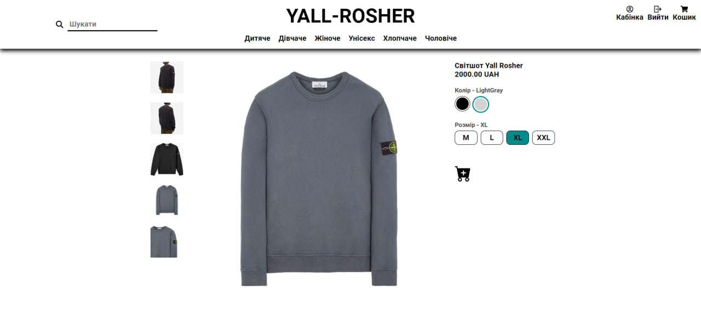

# Yall Rosher

Yall Rosher is a full-stack web application written in React and Django. It is a clothing branding website.

UNFORTUNATELY, the frontend had some issues and was unable to complete this project properly

But the backend has much more functionality than the frontend gives us.

## Technologies that was used:
1. Django Rest Framework (For managing api views)
2. React (As frontend)
3. AWS EC2 (As deploy service)
4. Celery (For managing sending letters)
5. Redis (As celery broker)
6. Docker-compose (For managing the microservices)
7. Swagger documentation

## Deploy

Yall Rosher is hosted on EC2 AWS instance  [web-site](https://yall-rosher.pp.ua/) on "https"

## Installation

To run this application, install [docker](https://www.docker.com/products/docker-desktop/) locally.
Use the docker-compose.yml file to start up an application.

### How to run:
- Copy .env.sample -> .env and populate with all required data
- `docker-compose up --build`
- Create admin user (Optional)
- `docker-compose exec -ti backend python manage.py createsuperuser`

Test admin user:
username: `yaros`
password: `111`

## Demo of site

## License

MIT License

Copyright (c) 2024 Yaroslav Biziuk, Makxym Bondarenko

Permission is hereby granted, free of charge, to any person obtaining a copy
of this software and associated documentation files (the "Software"), to deal
in the Software without restriction, including without limitation the rights
to use, copy, modify, merge, publish, distribute, sublicense, and/or sell
copies of the Software, and to permit persons to whom the Software is
furnished to do so, subject to the following conditions:

The above copyright notice and this permission notice shall be included in all
copies or substantial portions of the Software.

THE SOFTWARE IS PROVIDED "AS IS", WITHOUT WARRANTY OF ANY KIND, EXPRESS OR
IMPLIED, INCLUDING BUT NOT LIMITED TO THE WARRANTIES OF MERCHANTABILITY,
FITNESS FOR A PARTICULAR PURPOSE AND NONINFRINGEMENT. IN NO EVENT SHALL THE
AUTHORS OR COPYRIGHT HOLDERS BE LIABLE FOR ANY CLAIM, DAMAGES OR OTHER
LIABILITY, WHETHER IN AN ACTION OF CONTRACT, TORT OR OTHERWISE, ARISING FROM,
OUT OF OR IN CONNECTION WITH THE SOFTWARE OR THE USE OR OTHER DEALINGS IN THE
SOFTWARE.
